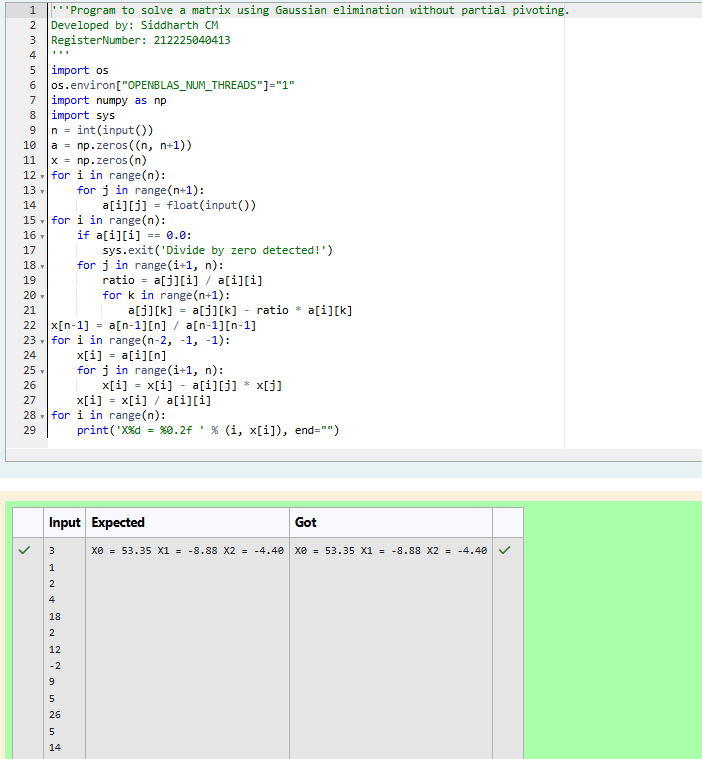

# Gaussian Elimination

## AIM:
To write a program to find the solution of a matrix using Gaussian Elimination.

## Equipments Required:
1. Hardware – PCs
2. Anaconda – Python 3.7 Installation / Moodle-Code Runner

## Algorithm
1. Read n, matrix A, and vector B; initialize solution vector X.
2. Convert A to upper triangular form using forward elimination.
3. Compute unknowns using back substitution.
4. Print the solution vector X
## Program:
```
/*
Program to find the solution of a matrix using Gaussian Elimination.
Developed by: Siddharth CM
RegisterNumber: 212225040413
*/
```

## Output:


## Result:
Thus the program to find the solution of a matrix using Gaussian Elimination is written and verified using python programming.

